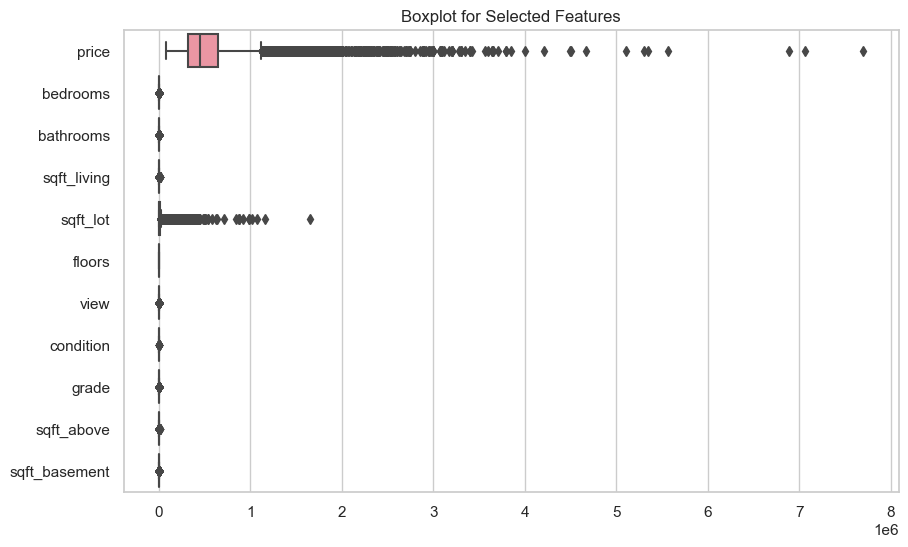
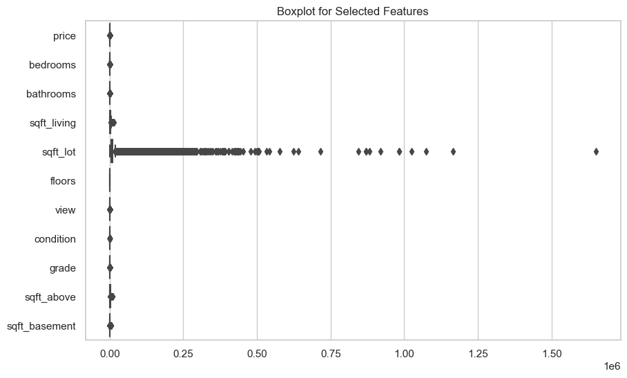
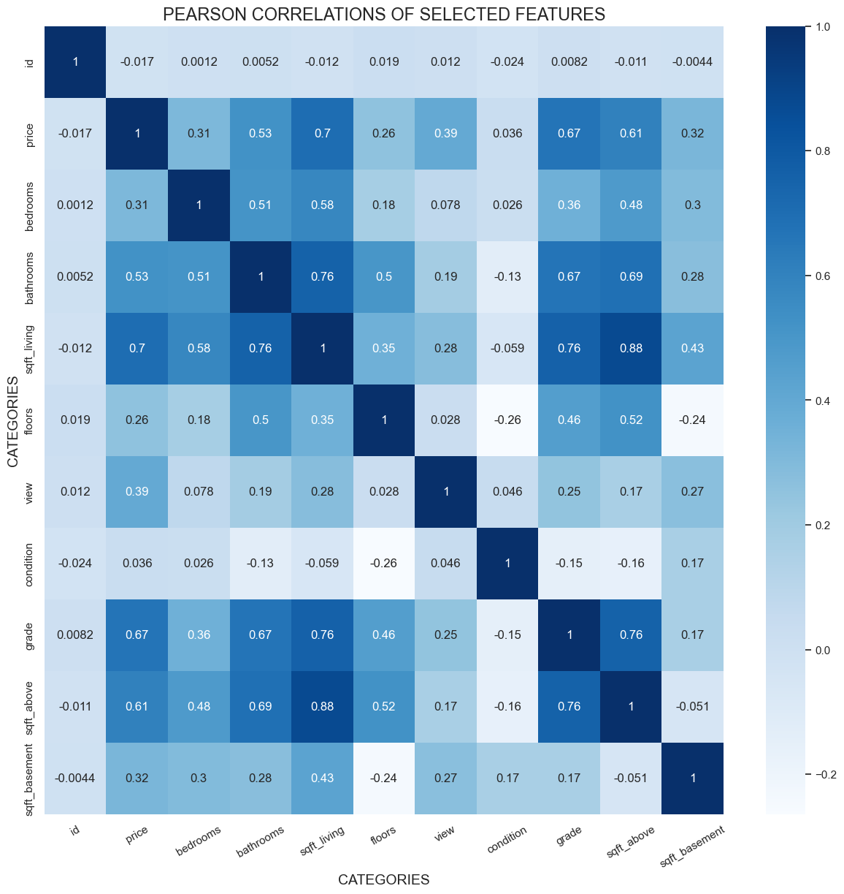
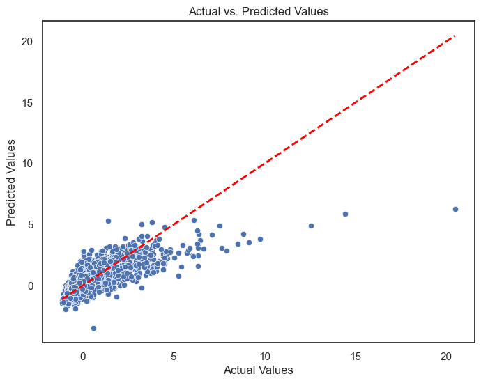
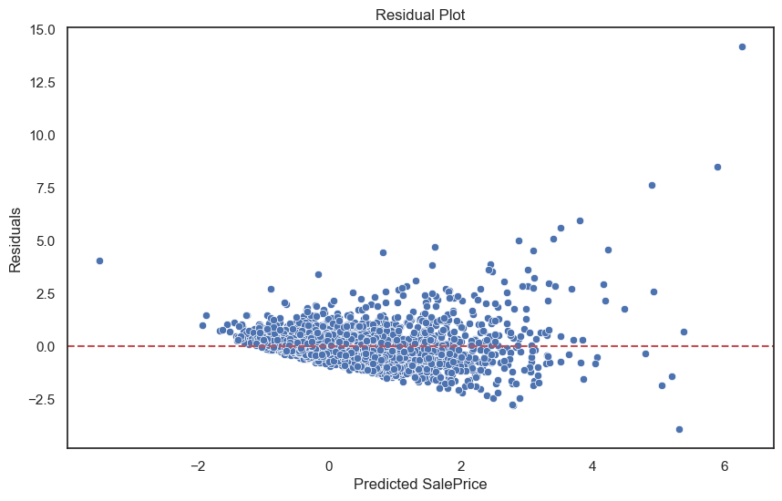
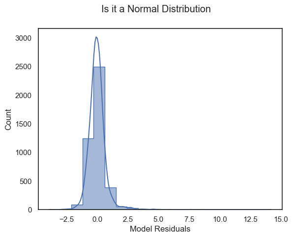
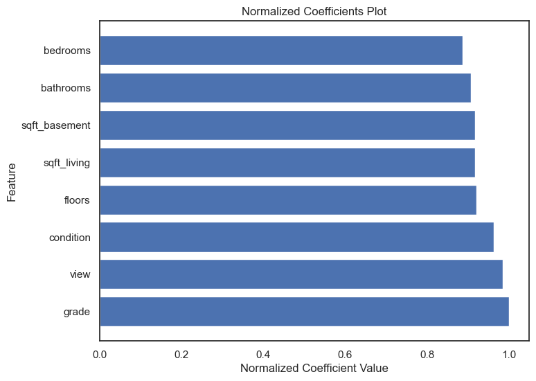

## Project Description
In this project description, we will cover:
* The Project Overview
* Business Understanding: 
  - Explaining stakeholders, stakeholder audience and key business questions
* Data Analysis:
  - Source of data and deliverables
  - Data Description 
  - Data Understanding
    **Modeling**
    **Regression Results** 
* Recommendations 
* Conclusion:
  - Summary and three relevant findings.

## Project Overview

This project aims to guide real estate brokers and agents in the northwestern county with the help of a data-driven renovation roadmap. We will use multiple linear regressions to analyze a comprehensive dataset of house sales in the region. By identifying key features that statistically impact price, we will create a predictive model that can estimate the price boost due to specific renovations .

Get ready to close deals faster and leave the competition in the dust!

## Business Understanding

* Target stakeholders: Real estate agents and brokers: 
- They directly influence the final sale price through their market knowledge.
- They recommend strategic renovations to homeowners which would increase property appeal and value.

* Stakeholder audience:
- Sellers: Require accurate pricing strategies, effective marketing tactics and expert guidance on negotiations.
- Homeowners: Highlighting their desire to improve their living space or increase the value of their property by considering renovations.

A business problem is the need for stakeholders to provide advice to homeowners about how home renovations might increase the estimated value of their homes and by what amount. We seek to solve this by equipping them with data-driven insights, guiding homeowners to strategic renovations that boost property value. 

#### Key Business questions 

1. Which feature has the strongest impact on sale price? 
2. How much more valuable is a house for every additional square foot of living space?
3. What characteristics are common among homes that have experienced significant price change?
4. Can we develop a model to predict potential price growth for different renovations? 
5. How much can the estimated sale price increase by with individual renovations or combinations? 

## Data Analysis

#### The Source of Data

This project uses the King County House Sales dataset, which can be found in  `kc_house_data.csv` in the data folder in this project's GitHub repository. The description of the column names can be found in `column_names.md` in the same folder. 

Access:  https://github.com/otienobaker1/MORINGA_GROUP_1_PHASE_2_REPO/tree/main

#### Deliverables
There are three deliverables for this project:

1. A **non-technical presentation** - [Presentation](<DSF_PT5 GROUP  I PHASE II PROJECT_FINAL.pdf>) 
- Can also be accessed from: https://www.canva.com/design/DAF33WZlnY8/b7OXuO_Rh-aKHLQh0S4NFg/edit
2. A **Jupyter Notebook**- [Group1Phase2ProjectNotebook](Group1Notebook.ipynb)
3. A **GitHub repository** -https://github.com/otienobaker1/MORINGA_GROUP_1_PHASE_2_REPO/tree/main

#### Data Description 

The data we have used in this dataset with their respective datatypes and descriptions include:
* `price`      float64(numeric): The sale price of the house (in US dollars)
* `bedrooms`  int64(numeric): The number of bedrooms.
* `bathrooms`  float64(numeric): The number of bathrooms.
* `sqft_living`   int64(numeric): The square footage of the living space in square feet.
* `sqft_lot`  int64(numeric): The square footage of the lot in square feet.
* `floors`    float64(numeric): The number of floors in house.
* `view`    int64(numeric): The quality of the view from house
* `condition`    int64(numeric): A number describing how good the condition of the house is. 
* `grade`     int64(numeric): A grade assigned to the house based on its overall condition.
* `sqft_above`    int64(numeric): The square footage of house apart from basement.
* `sqft_basement` float64(numeric): The square footage of the basement in square feet

#### Data Understanding

* Why do we use regression coefficients?
- We use regression coefficients over graphs because they provide accuracy and in-depth analysis for analyzing house prices. They tell you exactly how each feature, like grade or bedrooms, impact the prices while holding other variables constant. 
- It is crucial for dealing with multiple, potentially non-linear relationships in our data. Additionally,regression is a perfect fit for capturing the full picture and predicting new sale prices now that it involves numerical and categorical variables.

***Importing and Data Inspection*** 
- We start by importing the necessary libraries for data analysis, visualization, modeling and evaluation.
- It prepares for data exploration by importing the given dataset into a DataFrame for further processing. 
- We inspect the data by display the first 5 records, check the data types, descriptive statistics, and data shape.

***Data Cleaning and Preparations***
* Addressing missing values and preparing categorical data for analysis:
- Firstly, missing values are identified in columns like "view" and "sqft_basement" replacing them with appropriate values i.e "NONE" for "view" and 0 for "sqft_basement"
- It maps categorical values in "view" and "condition" columns to numeric representations for quantitative analysis, for example: 'NONE'converted to 0, 'FAIR'to 1 etc.
- It cleans and splits the "grade" column into numerical "grade" and textual "grade_description".
- Finally, removes columns seen as less relevant to the analysis to focus on the most impactful features.

***Checking and removing outliers***
- A boxplot is introduced to visually identify outliers (data points that significantly deviates from the typical pattern of the rest of the data). 
Outliers can:
- Distort statistical measures like mean and standard deviation.
- Impact model performance and prediction accuracy.
- Reveal errors in data collection or when recorded.

* Removal of outliers: 
1. Calculating interquartile range (IQR) and identifying outliers in price:
- Using a statistical measure like finding the IQR to define outlier boundaries.
- Multiplying 1.5 by the IQR as a common threshold.
- Identifies outliers by flagging values in the price column falling outside the threshold.
- Then, calculating the percentage of outliers to show the proportion of outliers.

2. Handling Outliers:
- A robustscaling technique is initiliazed which is less sensitive to outliers.
- Adjusts and transforms price to mitigate outlier effects using the scaler.

3. Rechecking Outliers:
- Recheck for outliers after scaling by selecting the columns again.
- Creates boxplot: 

\\Due to persistent outliers in the sqft_lot column, this feature is ultimately removed from the dataset\\
5. Dropping the sqft_lot variable:
- We use the drop column function to remove the sqft_lot column due to its consistent outlier issue.
- To confirm sqft_lot has been dropped, we display the first few rows of the modified dataset. 

***Data Modeling***
- Correlation is used to help point out which variables have the strongest relationships with price.
- The correlation is compared for various numerical variables with the dependent variable, price, showing that there is a positive relationships for factors like bathrooms (0.52), sqft_living (0.70), grade (0.67) and view (0.39).
- A comprehensive correlation matrix is created using Pearson's correlation coefficient to give a visual overview of how all numerical variables relate to each other, not just with price.
- This 'Heatmap' provides a  great view of the complex web of relationships.

- 1 indicates a perfect positive correlation: as one variable increases, the other also increases.
- -1 indicates a perfect negative correlation: as one variable increases, the other decreases.
- 0 indicates no correlation: the variables are not related in any way.

***Regression Modeling***
- After identifying the numeric data with the highest correlation with price,sqft_living(correlation of 0.7), a simple regression has been provided below to answer our second business question.
- The code preps the data by:
1. Splitting it, into training (80%) and testing (20%) sets. 
2. Adds an intercept or a constant term 
3. Trains the model by using the Ordinary Least Squares (OLS) method from the statsmodels library to fit a linear regression model using sqft_living to predict the price. 
5. Once the model is trained, it's applied to the unseen test data allowing proper view of how well the model performs on data it hasn't been trained on, providing a more realistic estimate of its accuracy.
6. Evaluating Performance using Mean Absolute Error (MAE) to measure the average absolute difference between predicted and actual prices. A lower MAE indicates a better fit.
7. Finally, it provides a detailed summary of the model's parameters and fit. 

Mean Absolute Error on Test Data: 0.5293588998747824
                            OLS Regression Results                            
==============================================================================
Dep. Variable:                  price   R-squared:                       0.492
Model:                            OLS   Adj. R-squared:                  0.492
Method:                 Least Squares   F-statistic:                 1.676e+04
Date:                Fri, 29 Dec 2023   Prob (F-statistic):               0.00
Time:                        16:31:48   Log-Likelihood:                -20954.
No. Observations:               17277   AIC:                         4.191e+04
Df Residuals:                   17275   BIC:                         4.193e+04
Df Model:                           1                                         
Covariance Type:            nonrobust                                         
===============================================================================
                  coef    std err          t      P>|t|      [0.025      0.975]
-------------------------------------------------------------------------------
const          -1.5370      0.015   -100.050      0.000      -1.567      -1.507
sqft_living     0.0009   6.75e-06    129.476      0.000       0.001       0.001
==============================================================================
Omnibus:                    11495.535   Durbin-Watson:                   1.996
Prob(Omnibus):                  0.000   Jarque-Bera (JB):           371098.388
Skew:                           2.737   Prob(JB):                         0.00
Kurtosis:                      25.035   Cond. No.                     5.65e+03
==============================================================================

Notes:
[1] Standard Errors assume that the covariance matrix of the errors is correctly specified.
[2] The condition number is large, 5.65e+03. This might indicate that there are
strong multicollinearity or other numerical problems.

* Extracting coefficients: 
- Another code first retrieves the coefficients and intercept from the fitted regression model using model.params.
- Coefficients are stored in a DataFrame with a "const" column representing the intercept and a "sqft_living" column representing the slope of the linear relationship.

* Interpreting the results of the above regression:
- With one unit increase in sqft_living, there is a 0.000874 unit increase in the prices of the houses with other factors held constant.
- Mean Absolute Error (MAE): 0.5293 shows an average prediction error of about 0.53 units in terms of price.
- R-squared of 0.492: The model explains about 49.2% of the variation in house prices, suggesting a strong fit.
- Adjusted R-squared of 0.492: Implies that the model's fit is not significantly affected by the number of variables used.
- F-statistic of 1.676e+04: Highly significant, suggesting a strong relationship between sqft_living and price.
- Intercept of -1.537: The predicted price for a house with 0 square feet (unrealistic but a statistical starting point for a model)
- Statistically significant (p-value <= 0.000): Overall, the model is statistically significant as the relationship between sqft_living and price is unlikely to be a coincidence.

***Multiple linear regression***

Mean Absolute Error on Test Data: 0.47135567865530736
                            OLS Regression Results                            
==============================================================================
Dep. Variable:                  price   R-squared:                       0.591
Model:                            OLS   Adj. R-squared:                  0.591
Method:                 Least Squares   F-statistic:                     2775.
Date:                Fri, 29 Dec 2023   Prob (F-statistic):               0.00
Time:                        16:31:48   Log-Likelihood:                -19085.
No. Observations:               17277   AIC:                         3.819e+04
Df Residuals:                   17267   BIC:                         3.827e+04
Df Model:                           9                                         
Covariance Type:            nonrobust                                         
=================================================================================
                    coef    std err          t      P>|t|      [0.025      0.975]
---------------------------------------------------------------------------------
const            -3.6202      0.062    -58.104      0.000      -3.742      -3.498
bedrooms         -0.1201      0.008    -15.121      0.000      -0.136      -0.105
bathrooms        -0.0372      0.012     -2.986      0.003      -0.062      -0.013
sqft_living       0.0005   7.78e-05      6.138      0.000       0.000       0.001
floors            0.0134      0.014      0.963      0.336      -0.014       0.041
view              0.2638      0.008     33.784      0.000       0.248       0.279
condition         0.1780      0.009     19.872      0.000       0.160       0.196
grade             0.3235      0.008     40.055      0.000       0.308       0.339
sqft_above     9.304e-05   7.75e-05      1.201      0.230   -5.88e-05       0.000
sqft_basement     0.0002   7.71e-05      2.746      0.006    6.06e-05       0.000
...
Notes:
[1] Standard Errors assume that the covariance matrix of the errors is correctly specified.
[2] The condition number is large, 3.41e+04. This might indicate that there are
strong multicollinearity or other numerical problems.

* Interpreting results of the coefficients and intercept from the regression output:
- The model does a better job of predicting house prices now as there is improved accuracy and a stronger fit because of the increase in R-squared, 0.591. 59.1% of the variance in price can now be explained by the included variables. 
- Now that other factors are being considered, the impact of sqft_living is slightly reduced to 0.0005 per square foot.
- Bedrooms and bathrooms have negative coefficients, which might reflect a reduction in price for every addition of each of these features. 
- View, condition, and grade have a significant positive impact on price. 
- The number of floors does not have a significant effect on price as the the standard error for floors, 0.014, is on the same level as the coefficient, indicating a larger degree of uncertainty around its estimate, similar case for sqft_above.
- Every additional square foot of basement space is associated with a price increase of 0.0002. 

***Model Evaluation***

* We test the performance of our regression model by plotting actual vs predicted values: 
- A scatter plot is created comparing the model's predicted values against the actual values in your test data to visually assess the model's performance. 
- The points should be closely packed around the diagonal red-dotted line (fit line) which will represent a perfect prediction. 
- Deviations from this line brings about potential model inaccuracies.
- By analyzing the scatter pattern and comparing it to the fit line, valuable insights is provided about how well your model captures the underlying relationship between the price and the features

***Interpretation of results***

* Residual Plot and Analysis:
- We calculate the residuals by subtracting the predicted values (y_pred) from the actual values (y_test). 
- The code visualizes the residuals to assess model fit, it evaluates how well the model captures the relationship between the variables. 
- The points should be randomly scattered around the horizontal line along the zero on the y-axis suggesting that the model's errors are random and unbiased, and that it is performing well.

- A histogram is generated to visually assess if the model's residuals follow a normal distribution, this is n important assumption for many statistical models. 
- It creates a histogram with 20 bins, overlays a density curve (KDE) to highlight distribution shape, and names the x-axis "Model Residuals." 
- The title "Is it a Normal Distribution?" directly prompts you to use this picture to judge if the errors behave like a normal distribution, which is important for statistical models to work properly.

***Testing for Multicollinearity***
* What is Multicollinearity?
-  Multicollinearity occurs when two or more independent variables, features, in a regression model are highly correlated, whereby they share a strong linear relationship.

* Issues with multicollinearity:
- It is hard to determine individual feature importance due to inflated standard errors of coefficients.  
- It is more difficult to interpret the model. 

- The code calculates Variance Inflation Factors (VIFs), measures the degree of multicollinearity for each feature, to identify potentially problematic correlations between variables.
- High VIFs, greater than 5 or 10, indicate multicollinearity.

* Interpreting results:
- Sqft_living (VIF = 649.74) and sqft_above (VIF = 465.50) have the highest VIFs, indicating high multicollinearity.
- Bathrooms (VIF = 15.90),sqft_basement (VIF = 46.99) and grade (VIF = 25.97) also have VIFs above the threshold, indicating potential multicollinearity.
- Floors (VIF = 3.36) and view (VIF = 1.25) have VIFs below the threshold, indicating no multicollinearity issues.

* To address multicollinearity we chose to remove sqft_above since it is highly correlated with the sqft_living:  
- This has reduced the worst multicollinearity significantly but concerns remain with bathrooms, grade, bedrooms and condition still showing moderate  VIF values. 
- Feature engineering or alternative modeling techniques  could be considered in the future to address these issues and to improve your model's performance.

***Running our linear regression model with the remaining variables*** 

The remaining features have been added to the model: 
Mean Squared Error on Test Data: 0.5302992059110792
                            OLS Regression Results                            
==============================================================================
Dep. Variable:                  price   R-squared:                       0.591
Model:                            OLS   Adj. R-squared:                  0.591
Method:                 Least Squares   F-statistic:                     3122.
Date:                Fri, 29 Dec 2023   Prob (F-statistic):               0.00
Time:                        16:31:50   Log-Likelihood:                -19086.
No. Observations:               17277   AIC:                         3.819e+04
Df Residuals:                   17268   BIC:                         3.826e+04
Df Model:                           8                                         
Covariance Type:            nonrobust                                         
=================================================================================
                    coef    std err          t      P>|t|      [0.025      0.975]
---------------------------------------------------------------------------------
const            -3.6212      0.062    -58.124      0.000      -3.743      -3.499
bedrooms         -0.1203      0.008    -15.143      0.000      -0.136      -0.105
bathrooms        -0.0379      0.012     -3.038      0.002      -0.062      -0.013
sqft_living       0.0006    1.3e-05     43.658      0.000       0.001       0.001
floors            0.0149      0.014      1.077      0.282      -0.012       0.042
view              0.2634      0.008     33.763      0.000       0.248       0.279
condition         0.1777      0.009     19.842      0.000       0.160       0.195
grade             0.3238      0.008     40.122      0.000       0.308       0.340
sqft_basement     0.0001   1.65e-05      7.341      0.000     8.9e-05       0.000
=================================================================================
...
Notes:
[1] Standard Errors assume that the covariance matrix of the errors is correctly specified.
[2] The condition number is large, 2.61e+04. This might indicate that there are
strong multicollinearity or other numerical problems

* Interpretation of the results:
- An R-squared of 0.591 explains 59.1% of the price variation. 
- Features with positive effects on price include view, condition, grade, sqft_living and sqft_basement.
- Bedrooms and bathrooms have negative impacts on price. 
- The model's mean squared error on test data is 0.5303 which reflects its average prediction error.

Further:
***Model Evaluation***
- The model demonstrates good predictive performance with points clustering around the actual vs. predicted  diagonal line.
- Despite this positive indication, there's a need to investigate further and potentially enhance the model's performance.
***Interpretation of results***
* Residual Analysis:
- Was used to examine the pattern of prediction errors. 

* Normality of Residuals:
- A histogram of model residuals is created to assess whether they follow a normal distribution.

* Interpreting the coefficients of the model:
- The above coefficients show the extent in which the response variable (price) changes for a one unit increase in the predictor variables (features). These changes are either to the positive or to the negative.
- These interpretations assume a linear relationship, and the actual impact can be influenced by the scale of the variables and the presence of interactions.

***Normalizing Coefficients***
- Normalization scales the coefficients (adjusts their numerical values without changing their relative relationships to each other) to a common range of 0 to 1, for easier comparison of their relative importance within the model.
- A higher normalized value compared to other coefficients in the same model suggests a stronger relative impact on the predicted price.

* Method used and interpetation:
-The coefficients are rescaled by subtracting the minimum value and then dividing by the range (maximum minus minimum).
- In this model, grade has the strongest relative impact on price with a value of 1, followed by view, condition...., bedrooms have the weakest relative impact of 0.8874, while the intercept is always zero after normalization.
- The normalizaed coefficients are plotted: 

***Calculation of the price for the Regression Model***
- Price = -3.6202 - 0.12027(bedrooms) - 0.03785(bathrooms) + 0.00057(sqft_living) + 0.014909(floors) + 0.263445 (view) + 0.17767(condition) + 0.323798(grade)+ 0.00012(sqft_basement)+ e.

- Due to the different scales among the variables the regression coefficients were normalized to give interpretable Multiple linear regression coefficients: 

***Calculation of the price for the normalized model***
- Price = 0.000000 + 0.887435(bedrooms) + 0.908327(bathrooms) + 0.918066(sqft_living) + 0.921701(floors) + 0.984701(view) + 0.962958(condition) + 1.000000(grade) + 0.917953(sqft_basement)+ e.

* Interpretation:
- The MLR result was found to be exhibiting a statistical significance at 95% confidence level (p=0.00) with respect to the effect of 'sqft_living','bedrooms','floors','sqft_basement','condition','grade', 'view' and 'bathrooms' on price. The independent variables explain 59.1% of the price of the houses (R-squared= 0.591).
The factors ranked from the one with the highest impact on prices to the least are; 'grade', 'view','condition', 'floors',  'sqft_living', 'sqft_basement', 'bathrooms', and the least impactful variable on the price is 'bedrooms'.

## Recommendations 

1. Focus on Key Property Features: Our stakeholders should focus on key property features such as grade, view and condition that significantly influence housing prices. 
2. Upgrade Property Grades: Real estate developers and agencies should focus on improving the overall grade of properties, as it has a strong positive correlation with housing prices.
3.  Enhance Views: Properties with better views tend to have higher prices. Real estate developers and agencies should consider and enhance the views of their properties.

## Conclusion 
#### Key Findings
1. Grade, view, and condition are associated with significantly higher prices highlighting the value buyers place on quality and other factors, while bedrooms have the least. This can guide decision-making when optimizing housing features for higher value.
2. All the features involved significantly impact house price (p=0.00) and the model explains 59.3% of the price variance, indicating good overall performance.
3. Multicollinearity between features and non-normality of residuals can distort model coefficients and needs thourough and careful handling.

#### Summary 
This project utilizes the use of thorough multiple linear regressions, by analyzing the King County House Sales dataset. We identified key features that significantly impact housing price and predict potential price boosts due to specific renovations.The significance of using coefficients, in linear regressions, is that it reveals the key drivers of house prices in this market, providing insights of making smart decision. 
The findings highlight not only the physical size but also the importance of quality when determining housing prices. Additionally, consider exploring alternative modeling techniques or choosing relevant features to potentially improve overall model performance, accuracy and interpretability.

